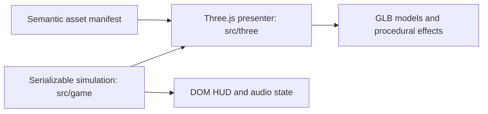

# ADR-0001: Three.js Presentation, Serializable Simulation, and GLB Contract

- **Status:** Accepted
- **Date:** 2026-09-12
- **Decision owner:** Sundown at Cinder Junction

## Context

The game has moved from the retired Phaser/isometric presentation to a
Three.js browser runtime. The gameplay systems already own enemies, towers,
waves, combat, economy, progression, grid/path rules, hero movement, save
concepts, DOM HUD, audio, Vite workflow, and tests. The renderer must make
those systems visible without becoming a second source of game state.

## Decision

Use imperative Three.js with WebGL as the shipping renderer. Keep all gameplay
authority in serializable JavaScript simulation state. `src/three/` reads that
state and creates or updates Three.js scene objects; it does not determine
damage, targeting, path validity, unlocks, wave results, or saves.

Use Blender-authored glTF 2.0 binary (`.glb`) as the runtime model format:

- Blender source and export scripts live under `assets/blender/`.
- Runtime models live under `public/assets/models/` and are registered through
  semantic keys in `src/game/assets/manifest.js`.
- One Blender unit equals one navigation cell; objects touch ground at local
  Y=0, use a centre pivot, and face local +X unless documented otherwise.
- Reusable modules have semantic node names so the presenter can vary them
  safely. Grid walls use procedural Blender geometry rather than generated
  mesh assets.

## Consequences

This keeps saves deterministic and makes room expansion, route validation, and
future render-room streaming possible without rewriting gameplay. It also
allows art to be replaced independently of rules. The cost is maintaining a
clear coordinate conversion and validating every exported GLB's pivot, scale,
materials, and semantic nodes.

The current bundle has a Vite chunk-size warning. Do not introduce code
splitting or a new renderer pre-emptively; measure the gameplay build when
room content makes that warning a player-facing performance issue.

## Alternatives considered

| Alternative | Decision |
| --- | --- |
| Restore Phaser/isometric presentation | Rejected; it conflicts with the desired 3D room and asset direction. |
| Native Godot client now | Deferred; the current two-room browser prototype is well within Three.js/WebGL scope. |
| React Three Fiber | Deferred; the existing imperative Vite/DOM-HUD architecture does not need a React host. |
| Three.js owns navigation and combat | Rejected; it would duplicate simulation authority and complicate saves/tests. |

## Verification contract

For renderer or asset changes:

1. Run `npm.cmd run check`.
2. Verify the browser's build, selection, placement, raid, and result loop.
3. Confirm the GLB has expected semantic nodes, sensible scale, correct ground
   contact, and no new console errors.
4. Profile before adding room streaming, asset compression, code splitting, or
   WebGPU.

## References

- `docs/studio/technical-preferences.md`
- `assets/blender/README.md`
- `src/game/assets/manifest.js`
- `src/three/`
