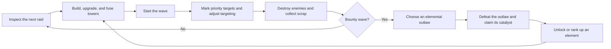

# Sundown at Cinder Junction — Game Design

This document preserves the original concept and first-playable plan for the
project.

A 2D tower-defense game about defending a battered jump-rail station on the edge of settled space.

You are the last Circuit Marshal at Cinder Junction. Raiders, war machines, and alien stampedes are converging on the station while an evacuation ship prepares to launch. You build improvised gun towers, collect elemental cores from notorious outlaws, and fuse those cores into increasingly dangerous frontier weapons.

Tagline: **Hold the line. Take the bounty. Bend the elements.**

### Design pillars

- **Elemental experimentation:** Combining elements should produce genuinely different towers, not simple damage bonuses.
- **Readable tactical combat:** Strong silhouettes, obvious status effects, and no visually muddy projectile spam.
- **Frontier improvisation:** Every tower looks built from mining gear, spaceship wreckage, ranch machinery, and outlaw weapons.
- **Player-chosen escalation:** The player chooses which elemental boss to fight—and therefore which technology becomes available next.
- **Low-micro, meaningful interaction:** Most power comes from planning, with one lightweight active ability to keep combat engaging.

## The core loop

A normal wave should take approximately 45–70 seconds, followed by a short planning phase. Building remains available during combat, and single-player pause is allowed.

Every fifth wave becomes a **Bounty Wave**:

1. The player chooses one of several wanted elemental outlaws.
2. That outlaw changes the next wave and acts as its boss.
3. Defeating the boss awards a catalyst for its element.
4. Repeated catalysts rank that element up.
5. Owning two different elements unlocks their fusion tower.

This makes progression part of the player’s strategy: you choose what the enemy becomes because you want what they are carrying.

## Player verbs

The essential actions are:

- Place a tower
- Select an elemental recipe
- Upgrade, fuse, or sell a tower
- Choose its targeting priority
- Inspect the next wave
- Select a bounty
- Start a wave early for bonus scrap
- Use **Deadeye** on a dangerous enemy

Deadeye is the sole active combat ability. It briefly slows time and lets the player mark one target. The marked enemy takes additional damage and pays a larger bounty when destroyed. It reinforces the gunslinger fantasy without turning the game into an action game.

## Element system

Use four foundational elements. Each should solve a different tactical problem.

| Element | Combat identity | Frontier presentation |
|---|---|---|
| Solar | Burning damage and regeneration suppression | Furnaces, flare rounds, glowing barrels |
| Cryo | Slowing and applying brittle | Refrigerant tanks, frost coils, cold smoke |
| Arc | Chaining damage and breaking shields | Tesla spurs, power lines, crackling lassos |
| Grav | Pulling enemies and stripping armor | Mining equipment, mass drivers, dark distortion |

Avoid complete elemental immunity. Resistant enemies can take roughly 30–40% less damage, but the player’s build should never become completely useless.

### Example towers

- **Peacemaker Turret:** Cheap neutral repeater; reliable but cannot scale indefinitely.
- **Sunspitter:** Solar gun that stacks burning damage.
- **Cold-Iron Longshot:** Cryo rifle that slows individual priority targets.
- **Storm Lasso:** Arc tower that chains between clustered enemies.
- **Gravhammer:** Short-range mass driver that damages armor and nudges enemies backward.

Fusion towers:

- **Boilerhouse** — Solar + Cryo: scalding bursts that expose affected enemies.
- **Railfire Battery** — Solar + Arc: beam damage that intensifies while held on one target.
- **Caldera Mortar** — Solar + Grav: launches shells that leave burning ground.
- **Whiteout Telegraph** — Cryo + Arc: chain lightning spreads brittle between enemies.
- **Undertow Well** — Cryo + Grav: pulls enemies into a freezing field.
- **Blackstar Corral** — Arc + Grav: periodically compresses a group before releasing an electrical blast.

For the first playable build, implement only three fusion towers. The others can follow after the economy and status system feel good.

## Enemy roster

Enemies should be recognized by shape before color:

- **Dust Mites:** Numerous, fragile alien creatures.
- **Rust Runners:** Fast raiders on hovering bikes.
- **Tinback Haulers:** Slow armored machines.
- **Spark Wagons:** Shield generators protecting nearby units.
- **Rift Leeches:** Regenerating creatures countered by Solar damage.
- **Siege Crawlers:** Long-range machines that temporarily disrupt a tower.
- **Elemental Outlaws:** Bounty bosses with mechanics reflecting the catalyst they carry.
- **The Black Comet:** Final raid engine and run-ending boss.

Enemy traits should encourage adaptation without prescribing one exact solution.

## Map design

The first map is a fixed-path switchyard that curls around a central buildable “corral.” This creates several satisfying crossfire locations without requiring player-created maze pathing.

Recommended first-map structure:

- One entrance and one station gate
- A long outer approach
- A tight central double-back
- 30–40 legal build cells
- Two high-value crossfire zones
- No path blocking
- A tactical-pan camera with modest zoom
- Entire route understandable at a glance

Later maps can introduce forks, moving cargo trains, low-visibility dust storms, and rail switches. Those should not enter the first prototype.

## Run structure

A complete run targets 25–35 minutes:

- Waves 1–4: establish the basic economy
- Wave 5: first bounty and first element
- Waves 6–9: introduce shields and armor
- Wave 10: second bounty; fusion towers become possible
- Waves 11–14: mixed enemy compositions
- Wave 15: third bounty and first serious build test
- Waves 16–19: elite variants
- Wave 20: final bounty
- Waves 21–24: endgame pressure
- Wave 25: The Black Comet

The station begins with a limited amount of hull integrity. Escaped enemies inflict damage based on threat level. The run ends when integrity reaches zero; victory comes from defeating the final raid engine.

## Economy

Keep the initial economy to two resources:

- **Scrap:** Earned from kills and early-wave bonuses; spent on towers and upgrades.
- **Catalysts:** Earned only from bounty bosses; unlock and rank elements.

Recommended rules:

- Selling returns approximately 70% of invested scrap.
- Starting a wave early grants a small time-based bonus.
- Bounty-marked enemies award extra scrap.
- No passive-interest system in the first prototype.
- No repair currency; station repair can appear as a rare between-wave choice later.

## Visual and audio direction

The art direction should evoke a lived-in frontier future without copying Firefly’s characters, ships, or iconography.

- Three-quarter top-down painted sprites
- Sun-bleached ochre, rust red, soot black, brass, and oxidized teal
- Cyan and violet reserved for advanced elemental effects
- Spaceships with covered-wagon and steam-locomotive silhouettes
- Towers made from antennae, fuel drums, ship guns, and mining machinery
- Pulp-comic shadows and slightly exaggerated silhouettes
- UI styled as a worn bounty ledger layered over imperfect holographic projections
- Slide guitar, jaw harp, analog synth drones, industrial percussion, and chunky mechanical weapon sounds

The canvas should carry the battlefield. Text-heavy tower details, bounty selection, settings, and wave information should live in a responsive DOM overlay around it.

## Preliminary Browser implementation plan

The strong fit could be:

- Phaser
- JavaScript
- Vite
- Phaser canvas for the battlefield
- DOM overlay for the HUD and menus
- Desktop-first mouse and keyboard controls
- Touch support after the desktop loop is proven
  (?)

Gameplay rules should live outside Phaser scenes:

- `WaveSystem`
- `EnemySystem`
- `TowerSystem`
- `CombatSystem`
- `StatusEffectSystem`
- `EconomySystem`
- `ElementRecipeSystem`
- `GameState`

Phaser scenes should only translate that state into sprites, animation, camera movement, particles, and sound. Save data should contain serializable game state and settings—not Phaser objects.

## First playable milestone

Build a 10–15 minute vertical slice containing:

- One switchyard map
- Ten normal waves and one final boss wave
- Scrap economy and station integrity
- Neutral tower plus four elemental towers
- Three fusion towers
- Six enemy types
- Two bounty decisions
- Deadeye ability
- Pause and 1×/2× speed
- Basic sound, impact effects, and placeholder sprites

The first balancing question should be: **Does choosing a bounty create an exciting new build direction within the following two waves?** If that works, the game’s central hook works.

---

## Current prototype status

The architecture skeleton now includes:

- A serializable, versioned `GameState` as the single source of truth
- Deterministic simulation updates outside Phaser
- Eleven placeholder raid definitions: ten normal waves plus The Black Comet
- Enemy, tower, combat, status, economy, wave, and recipe systems
- A real Phaser boot flow and battle scene
- A DOM-based HUD with raid, pause, and speed controls
- Click-to-place Peacemaker towers and placeholder combat
- Stable asset keys and a public asset layout
- Unit tests for state, map helpers, economy, recipes, and simulation integration

The next milestone is content depth: bounty selection, catalysts, four elemental
towers, three fusion towers, Deadeye, and authored placeholder art/audio.
